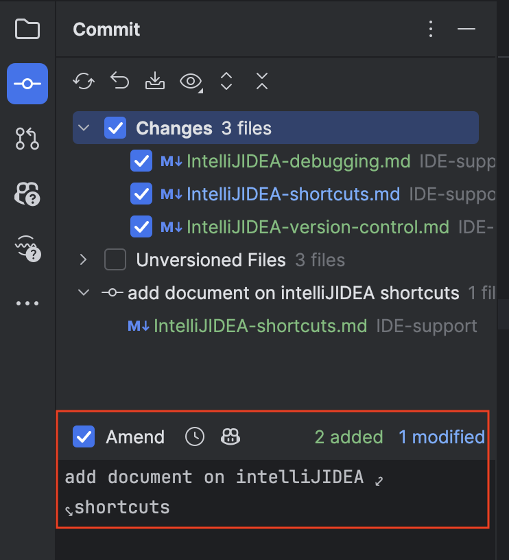

# IntelliJ IDEA Version Control Integration

## Git Log
Git > Log > HEAD
- Double-click on `HEAD`: Show commits only from the active branch

## Amending Commits
If you forgot to add some changes to last commit:
- then, select the `Amend` checkbox in the commit dialog to edit the last commit.

## Git Rebase

If there are commits in your upstream branch that you want to apply to your local branch, 
- `git fetch`
- select the branch and select the option `Rebase <FEATURE BRANCH> onto <UPSTREAM BRANCH>`
before pushing your changes to the remote repository.

### Interactive Rebase from here ...
- `Fix up`: add to the previous commit
- `Squash`: merge commits
- `command` + `return` → to return after editing the commit 

## Change `changelists`
- Right-click on the file in the commit dialog
  - ...

## Shelve Changes
- You can save changes in a file on your computer without committing them to the repository.
- Changes stored in a `shelf` can be applied later to any branch.
  - helps you avoid losing these changes if you switch branches

---

- Right-click on the changelist in the `Commit` tool window
- select `Shelve Changes...`

---

- You can see `shelf` tab in the `Commit` tool window

### Un-shelve Changes
- Right-click on the `shelf` tab in the `Commit` tool window
- select the changelist you want to apply
- `Unshelve...`
