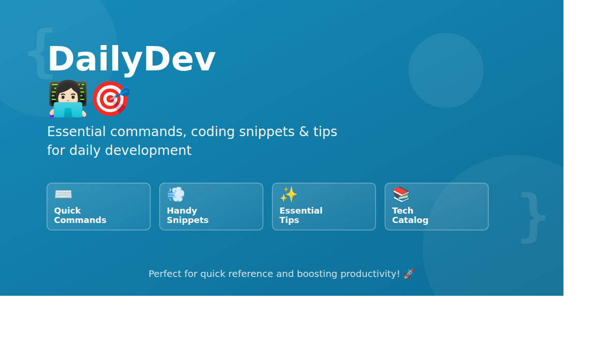

# DailyDev 👩🏻‍💻🎯

  

---

A concise collection of essential commands and coding snippets for daily development.

Perfect for quick reference and boosting productivity!

---

Welcome to **DailyDev**! 🚀 Your future go-to collection of essential commands, coding snippets, and handy tips for daily development. This repository is currently under development, but stay tuned for a treasure trove of resources to simplify your coding journey! 🛠️

* **Quick Commands**: Easily accessible terminal commands to streamline your workflow. ⌨️
* **Handy Snippets**: Reusable code snippets to accelerate your development process. 💨
* **Essential Tips**: Tips and tricks to enhance your coding efficiency. ✨
  
We are going to bring you a comprehensive and user-friendly reference that will boost your productivity and keep your development process smooth and efficient. Happy coding! 💻🎉

---

## Contents

- [clean coding](https://github.com/shadhini/daily-dev/blob/clean-coding)
    - [known bug fixes](https://github.com/shadhini/daily-dev/blob/clean-coding/fix-bugs)
    - good practices
      - [code quality & security vulnerability checking](https://github.com/shadhini/daily-dev/blob/clean-coding/practices-code-quality-n-security-vulnerability-checking.md)
- [design patterns](https://github.com/shadhini/daily-dev/blob/design-patterns)

---

- [osgi commands](https://github.com/shadhini/daily-dev/blob/osgi-commands)
- [git commands](https://github.com/shadhini/daily-dev/blob/git-commands)
- [mysql](https://github.com/shadhini/daily-dev/blob/mysql)

---

- [macOS](https://github.com/shadhini/daily-dev/blob/macOS)

---

## Templates | Starters

- Maven Multi Module Project Starter Template: [CODE](https://github.com/shadhini/daily-dev/blob/maven-multi-module-project-template) | [DOWNLOAD]()

---
- Jekyll Technology Catalog Template: [CODE]() | [DOWNLOAD]()

---

<!-- ---

### DailyDev 🌟
Welcome to **DevHelper**! 🚀 Your go-to collection of essential commands, coding snippets, and handy tips for daily development. Whether you're debugging, coding, or just looking for a quick reference, this repository has got you covered! 🛠️

- **Quick Commands**: Find those frequently used terminal commands at your fingertips. ⌨️
- **Handy Snippets**: Reusable code snippets to speed up your development. 💨
- **Essential Tips**: Tips and tricks to make your coding life easier. ✨

Perfect for developers who want to boost productivity and keep their development process smooth and efficient. Happy coding! 💻🎉

--- -->
