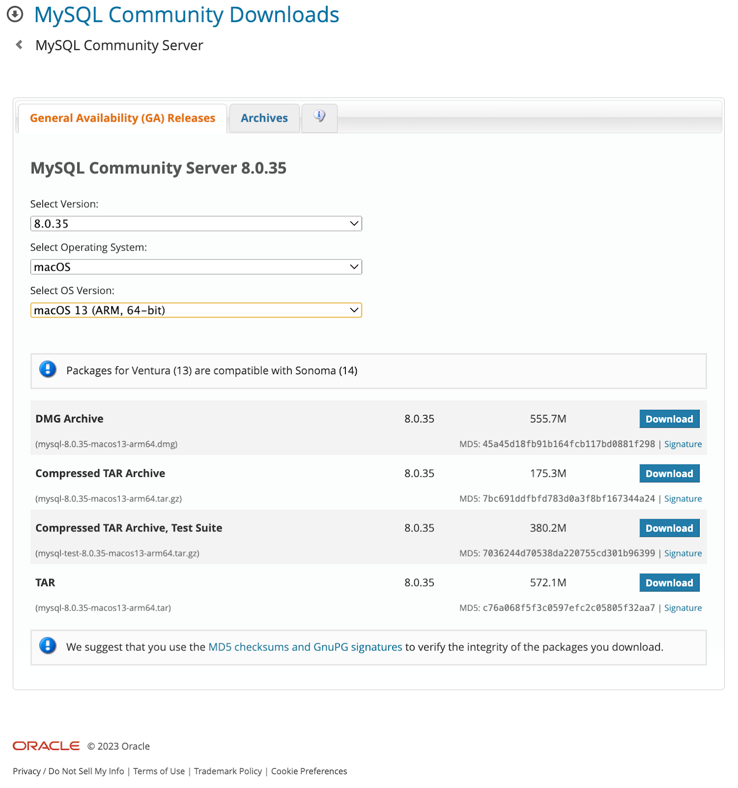

# Install: from the official website

1. Go to [https://www.mysql.com/downloads/](https://www.mysql.com/downloads/)
2. Click on **MySQL Community (GPL) Downloads »**
3. Click on **MySQL Community Server**
4. Select OS version and download the dmg file  
   
5. Click on downloaded dmg file and run the installer
6. Add the mysql to PATH variable

   * Open the `~/.zshrc` file and update the `PATH` as follows

            export PATH="/usr/local/mysql/bin:$PATH"
            source ~/.zshrc

7. Connect to mysql client to execute sql commands

            mysql -u USERNAME -p
            mysql -u root -p

# Install: using Homebrew

2 options: 
1. mysql: `brew install mysql`
   - Installs the full MySQL server (`mysqld`) and the client tools.
   - Installs service scripts you can run with brew services (`start/stop`).
   - Creates a local data directory (Homebrew default: `/opt/homebrew/var/mysql`).
   - Good when you want a local, persistent DB to import dumps into and query.
   - If you install mysql (full), Homebrew will link the client binaries into /opt/homebrew/bin and also print caveats with the service commands and socket locations.
   - Install if:
     - You want a local database to import dumps into and run queries directly from your machine.
     - You prefer a persistent local server accessible by GUI clients (`DBeaver`, `TablePlus`) without Docker.
 
2. mysql-client: `brew install mysql-client` (if you only want the client tools and not the server)
   - Installs only the client binaries (`mysql`, `mysqldump`, `mysqladmin`, `mysql_config`, etc.).
   - No server (no `mysqld`), no `brew service`, no local data directory.
   - Useful for connecting to remote DBs, CI/tools that just need the client, or when you’ll run the server in Docker.
   - mysql-client is `keg-only` by default, so Homebrew won’t symlink its binaries into `/opt/homebrew/bin` automatically.
     - After installing mysql-client add to your PATH: `export PATH="/opt/homebrew/opt/mysql-client/bin:$PATH"`
   - Install if:
     - You only need to connect to remote databases (production/test servers) or to Dockerized MySQL.
     - You want a lightweight install for command-line tools or CI tasks.
  
- You can install both (`client` + `server`) 
  - but `mysql-client` is typically used standalone only when you deliberately don’t want the server

## Start and stop MySQL server & Initial setup

Start as a background service: 

      brew services start mysql

Stop: 

      brew services stop mysql

Manual start/stop: 

      mysql.server start
      mysql.server stop

Data directory: 

      /opt/homebrew/var/mysql

Useful initial step after install: 
      
      mysql_secure_installation

