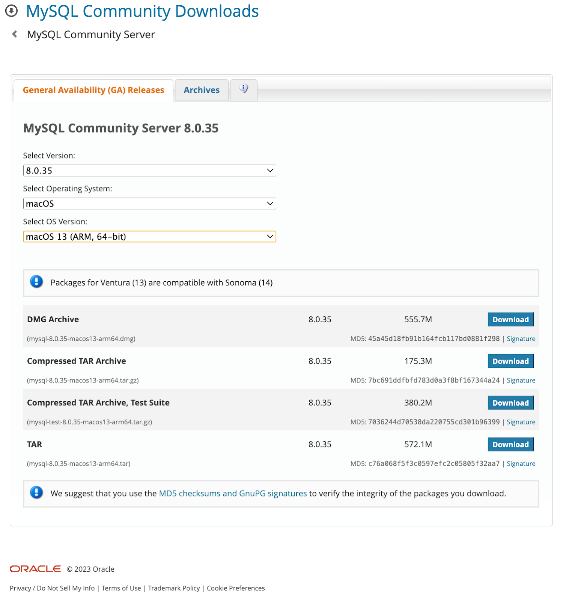

# Install

1. Go to [https://www.mysql.com/downloads/](https://www.mysql.com/downloads/)
2. Click on **MySQL Community (GPL) Downloads »**
3. Click on **MySQL Community Server**
4. Select OS version and download the dmg file  
   
5. Click on downloaded dmg file and run the installer
6. Add the mysql to PATH variable

   * Open the `~/.zshrc` file and update the `PATH` as follows

            export PATH="/usr/local/mysql/bin:$PATH"
            source ~/.zshrc

7. Connect to mysql client to execute sql commands

            mysql -u USERNAME -p
            mysql -u root -p

