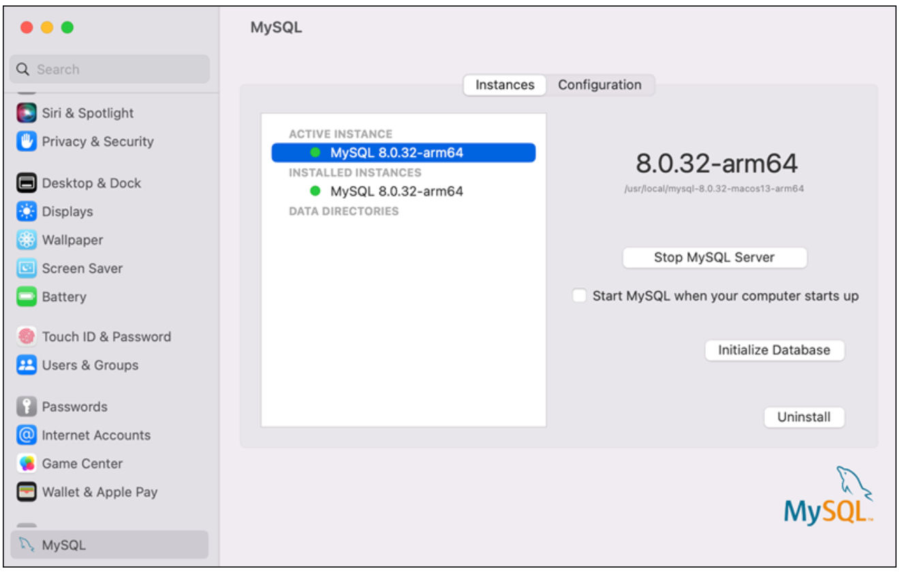
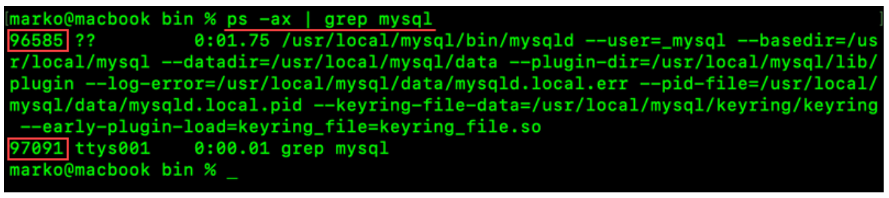

# Uninstall

1. Backup your files first.

        ./mysqldump -u root -p --all-databases > mysqlbackup.sql

2. Go to **System Settings** and click **MySQL**. Click the **Uninstall** button to remove MySQL from the system.

    

3. Check for running MySQL processes

    

        ps -ax | grep mysql
        kill <PID>
        kill 96585

4. Remove the default MySQL directory and all the leftover directories and files.

        sudo rm /usr/local/mysql
        sudo rm -rf /usr/local/mysql
        sudo rm -rf /usr/local/var/mysql
        sudo rm -rf /Library/StartupItems/MySQLCOM
        sudo rm -rf /Library/PreferencePanes/MySQL*
        sudo rm -rf /Library/Receipts/mysql*
        sudo rm -rf /private/var/db/receipts/*mysql*

5. open the `/etc/hostconfig` file and remove the following line

        MYSQLCOM=-YES\-

